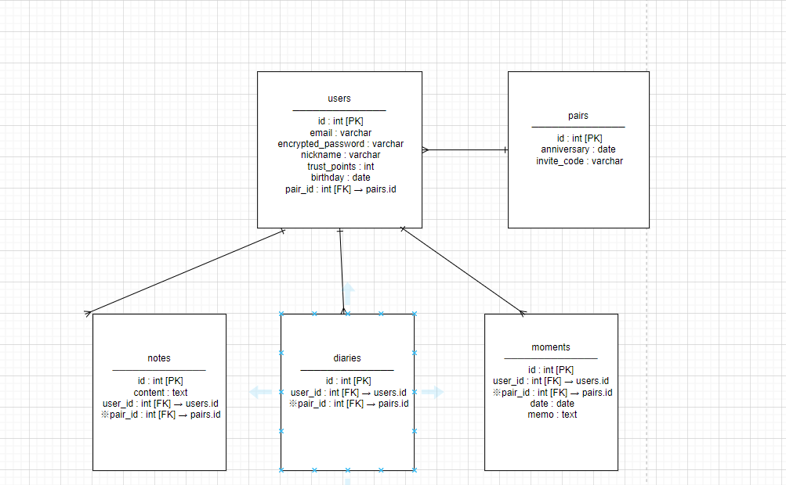

## アプリケーション名

**day×day.**

## アプリケーション概要

**day×day.** は、カップルや夫婦が "信頼" をやさしく育てていくための、ふたり専用の記録アプリです。

* 「ひとこと投稿」「日常の写真」「デート記録」などを通して、ふたりの"思い出"と"つながり"が自然に積み重なっていく体験を目指して設計中です
* SNSのような"返信の義務感"をなくし、ゆるやかに気持ちを共有できる構成を意識
* 投稿ごとに「信頼ポイント」がたまり、関係性を可視化できる仕組みを導入
* 招待コードでペアを結び、完全にふたり専用の空間を提供
* 投稿はモーダル形式で完結。今後はスマホでも直感的に使えるUIを目指して改善を続けていく予定です

※ 他ユーザーとの交流・比較機能は一切なし。
比較や嫉妬が生まれやすい現代だからこそ、「ふたりらしさ」に集中できる空間づくりを大切にしています。

## URL

[https://dayxday.onrender.com](https://dayxday.onrender.com)

## テスト用アカウント

* Basic認証：ユーザー名 `kkkk` / パスワード `1111`
* ユーザー1：[sample1@dayxday.com](mailto:sample1@dayxday.com) / パスワード：11111a
* ユーザー2：[sample2@dayxday.com](mailto:sample2@dayxday.com) / パスワード：11111a

※ 本番環境でログアウトが一時的に使用できないため、複数アカウント操作時はシークレットウィンドウまたは別ブラウザをご利用ください。

## 利用方法

1. 上記URLにアクセス
2. テスト用アカウントでログイン（または新規登録）
3. 片方のユーザーで「ペア作成」し、もう片方が「ペア参加」で招待コードを入力
4. ペア成立後、トップページで「ひとこと」「日常写真」「デート記録」を投稿
5. 投稿に応じて信頼ポイントが加算され、画面左上に表示されます

※両ユーザーで「ペア作成」を行うとペアが成立しないため、片方が「作成」もう片方は「参加」を選択してください

## アプリケーションを作成した背景
このアプリは、「信じたいのに、不安になってしまう」気持ちに寄り添いたいという思いから生まれました。

きっかけは、友人の結婚相手が抱えていた「浮気されそうで怖い」という不安の声でした。
過去の経験から、本人も「本当は疑いたくないけど不安になる」と悩んでおり、
そんな想いを少しでも軽くできる仕組みが作れないかと考えました。

監視や束縛ではなく、日々の自然な記録を通して安心感や信頼が少しずつ積み重なっていく、
そんな関係を支えるツールとして day×day. を開発しました。

## 機能一覧
- ひとこと投稿（1日1回・ランダムテーマ付き,信頼ポイント加算）
- 日常投稿（画像複数可、信頼ポイント加算）
- デート記録（特別な1枚を残す,信頼ポイント加算）
- 信頼ポイント自動加算
- ペア招待・作成機能
- 投稿のモーダル化＆非同期投稿（SPA風）

## 実装した機能の画像やGIF

| ページ                                                          | 説明                   |
| ------------------------------------------------------------ | -------------------- |
| [トップページ](https://gyazo.com/5fe38a0d20a68de4199fe3b5c8d75e9a) | 信頼ポイント・ひとこと・写真スライド表示 |
| [ひとこと投稿](https://gyazo.com/0d95b4cb05e019d538e670a7e6cbee74) | モーダル投稿（テーマ付き）        |
| [日常投稿](https://gyazo.com/4ae2e66ce1a6b1e4b78bf1f3af05118c)   | 写真を複数枚投稿     |
| [デート記録](https://gyazo.com/993c3c22bbf2a6764143ca0286c9b6c1)  | 特別な1枚とメモ、日付を記録       |
| [日常一覧](https://gyazo.com/c95f0d80d0f664ecd60fa44dffca3ab9)   | 日常画像を拡大カード形式で表示      |

## 今後実装予定の機能
冷却ルーム
　喧嘩直後に感情を整理できるスペース。問いかけ形式で冷静な対話を促す。

信頼グラフ & 記念バッジ
　信頼ポイントの推移を可視化し、継続や仲直りでバッジ・称号を獲得。

リマインド通知 & 続けやすいUI
　義務感を生まない通知設定と、ウィジェット・モーダル投稿など手軽なUX設計。
etc...
## データベース設計

2025/5/13時点.

## 画面遷移図
https://gyazo.com/babf8a28c212be2a1415fade888b3847


## 開発環境

| 項目      | バージョン・サービス                               |
| ------- | ---------------------------------------- |
| 言語      | Ruby 3.2.0                               |
| フレームワーク | Ruby on Rails 7.1.5.1                    |
| データベース  | MySQL（開発） / PostgreSQL（本番）               |
| フロントエンド | HTML / SCSS / JavaScript（ES6）            |
| ライブラリ   | Bootstrap 5.3 / Swiper.js v11            |
| 認証      | Devise / Basic認証                         |
| 画像管理    | ActiveStorage / MiniMagick               |
| デプロイ    | Render                                   |
| テスト     | RSpec / FactoryBot / Capybara / Selenium |
| バージョン管理 | GitHub                                   |

## ローカルでの動作方法

```bash
# リポジトリをクローン
git clone https://github.com/Kei-bigginer/original_app-42272

# Gemをインストール
bundle install

# データベースを作成・マイグレーション
rails db:create
rails db:migrate

# サーバーを起動
rails s
```

[http://localhost:3000](http://localhost:3000) にアクセスして確認できます。

## 工夫したポイント
* 投稿をすべてモーダル化し、画面遷移のストレスを排除
* 招待コードによる1対1ペア設計で、ふたりだけの安心空間を実現
* 投稿ごとの「信頼ポイント」で、気持ちや行動が“積み重なっていく”設計
* トップページは、記録と信頼を視覚的に伝える構成（ポイント＋スライド）

## 今後の課題
* トップページのUI最終調整とデザイン統一
* 通知機能の追加（継続利用を促す）

## 制作期間

約2週間
